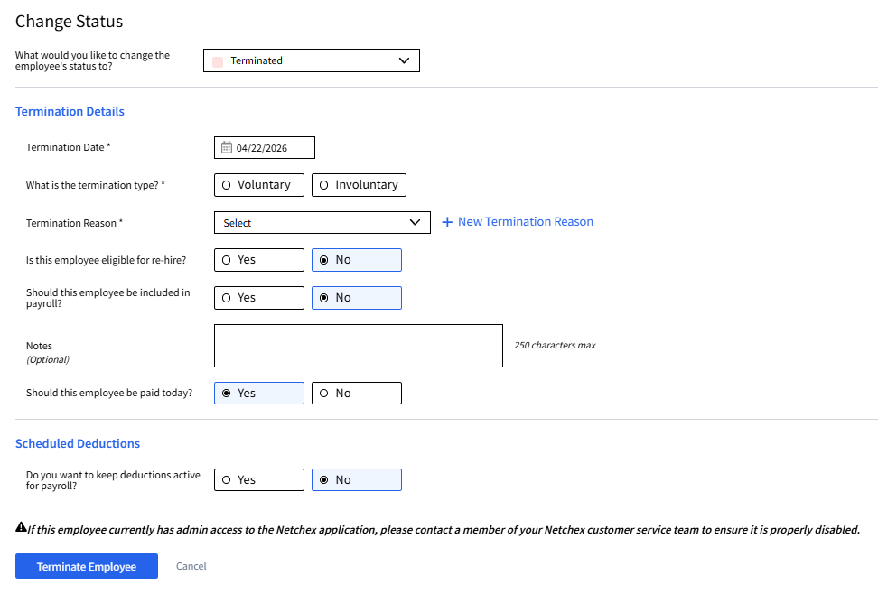
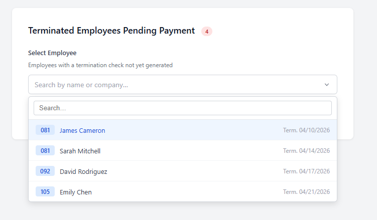
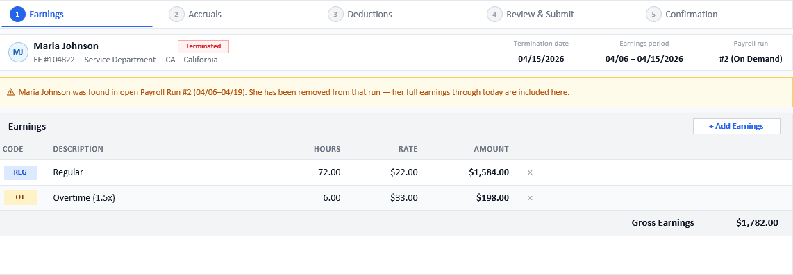
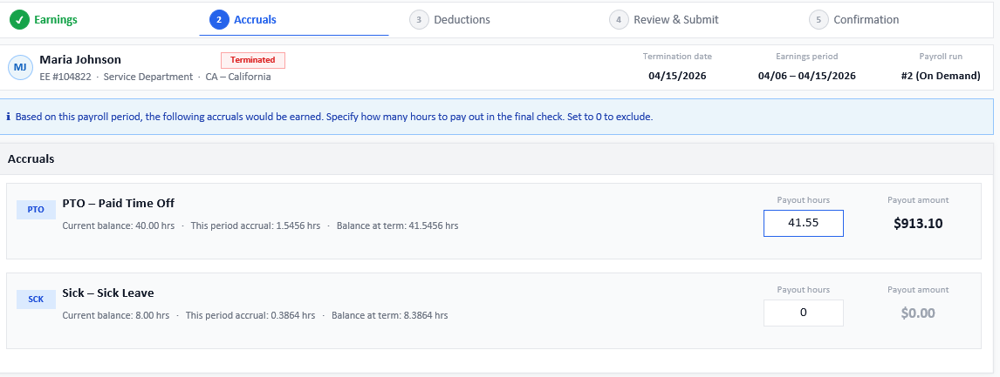
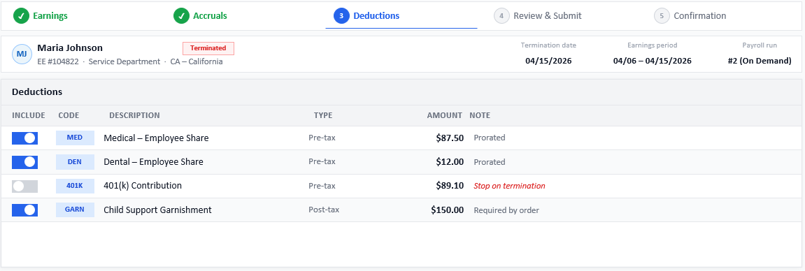
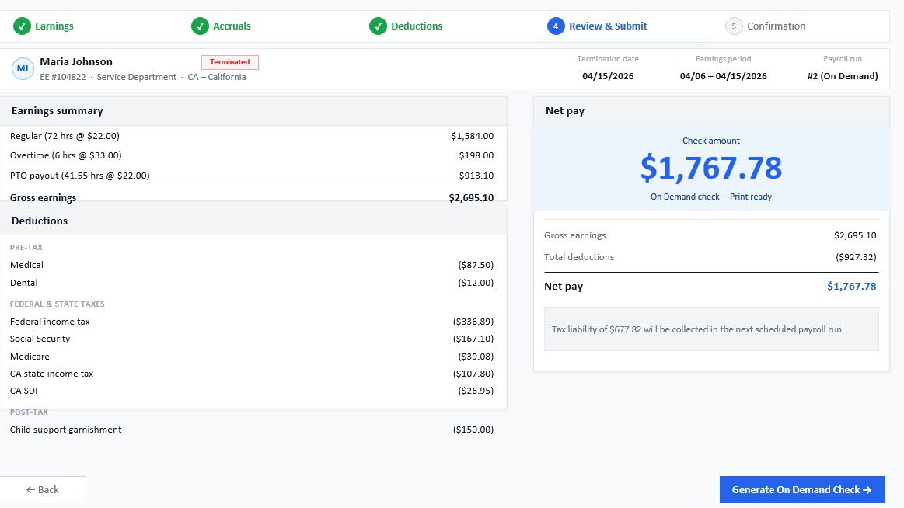
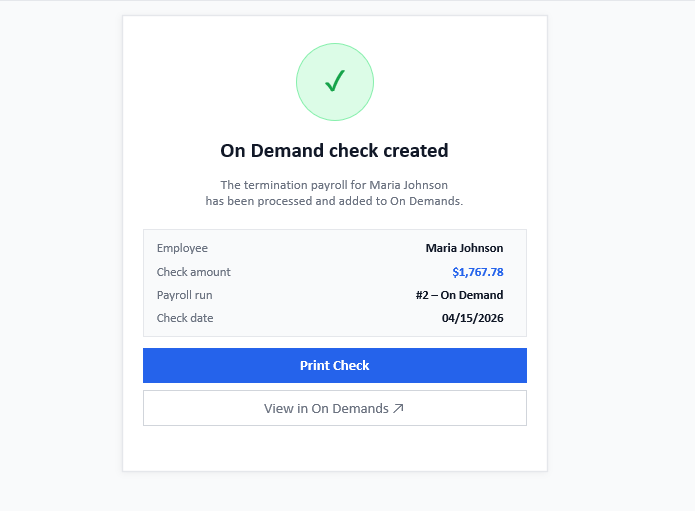

# Termination Payroll — Technical Spec

**Last Updated:** 2026-04-30
**Purpose:** End-to-end technical reference for the Termination Payroll Wizard covering architecture, user flow, API contracts, and implementation status.
**Owners:** [Paul](mailto:umbaike@netchexonline.com)

---

## Table of Contents

- [Overview](#overview)
- [Architecture](#architecture)
  - [State Machine](#state-machine)
  - [Two-Check Logic](#two-check-logic)
  - [In-Memory Calculation](#in-memory-calculation)
  - [Concurrency Lock](#concurrency-lock)
- [Step 1 — Entry Points](#step-1--entry-points)
  - [1.1 Entry Point 1 — Change Status Modal](#11-entry-point-1--change-status-modal)
  - [1.2 Entry Point 2 — Terminated Employees Pending Payment](#12-entry-point-2--terminated-employees-pending-payment)
- [Step 2 — Termination Payroll Wizard](#step-2--termination-payroll-wizard)
  - [2.1 Pre-flight Data Load](#21-pre-flight-data-load)
  - [Screen 1: Earnings](#screen-1-earnings)
  - [Screen 2: Accruals](#screen-2-accruals)
  - [Screen 3: Deductions](#screen-3-deductions)
- [Step 3 — Review & Submit](#step-3--review--submit)
  - [3.1 Engine Calculate Call](#31-engine-calculate-call)
  - [3.2 Generate On Demand Check](#32-generate-on-demand-check)
- [Step 4 — Confirmation](#step-4--confirmation)
  - [4.1 Commit Call](#41-commit-call)
  - [4.2 Server-Side Process Flow](#42-server-side-process-flow)
  - [4.3 Open Questions](#43-open-questions)
- [Work Breakdown](#work-breakdown)
  - [Completed](#completed)
  - [In Progress](#in-progress)
  - [Pending / External Dependencies](#pending--external-dependencies)

---

## Overview

The Termination Payroll Wizard generates a final paycheck for a terminated employee. The feature is split across two domains: the **employee domain** handles the termination status change, and the **payroll domain** handles check generation. These are intentionally decoupled so different users can perform each step, and so a termination payroll can be run hours or days after the termination date.

The process is a strict two-step sequence:

```
1. Terminate employee  →  2. Process termination payroll
```

Payroll is only reachable after the employee is in a confirmed terminated state, eliminating the risk of generating a check for an employee whose termination was later cancelled.

---

## Architecture

### State Machine

Tracked on `Person_Hire.TermPayroll_Status_Cd`:

```
[Employee terminated — "Paid today?" = Yes]
              │
              ▼
         InProcess ──── wizard completed ────► Paid
```

| Code | Set when | Meaning |
|---|---|---|
| `InProcess` | Admin confirms termination with "Paid today?" = Yes | Termination payroll not yet generated |
| `Paid` | Commit call succeeds | Termination check successfully generated |

---

### Two-Check Logic

When the employee's **last scheduled pay period was not processed**, two sequential on-demand checks are required.

```
Last period paid:    ──────────────────────────────────────────────────────────
                     [ current partial period only — Check 1 ]

Last period unpaid:  ──────────────────────────────────────────────────────────
                     [ full prior unpaid period — Check 1 ] ──► [ current partial period — Check 2 ]
                                                                  (uses Check 1 YTD accumulators)
```

Two checks are required because accrual rollovers, deduction caps, and tax accumulators depend on correct payroll sequence. Combining both periods into one check produces incorrect results.

The preflight response reflects this: single-check scenarios return one entry, two-check scenarios return two.

---

### In-Memory Calculation

Earnings, deductions, and accruals are computed in memory and written directly to paycheck history tables. The process does not write to `Person_Charges` or `Person_ChecksToPrint`, avoiding conflicts with active scheduled payrolls running concurrently.

---

### Concurrency Lock

**P0 requirement.** A company-level mutex must prevent simultaneous execution of a termination payroll and a scheduled payroll confirmation for the same company. Both processes assign payroll numbers and collect taxes; concurrent execution produces incorrect results.

The lock must be implemented in both:
- `www` (Run & Review)
- `Netchex.Payroll.Api` (Review & Submit)

---

## Step 1 — Entry Points

There are two ways to reach the Termination Payroll wizard. Both converge at the same wizard URL and follow an identical flow from Step 2 onwards.

```
Entry Point 1 ──┐
                ├──► https://{host}/a/payroll/multi-company/start/termination
Entry Point 2 ──┘      ?companyCode={companyCd}&employeeCode={employeeCd}
```

---

### 1.1 Entry Point 1 — Change Status Modal

User sets employee status to **Terminated** with **"Paid today?" = Yes**.

> When "Paid today?" is Yes, "Include in payroll?" is forced **No** and disabled.



On submit:
- Employee status → **Terminated**
- `person_hire.TermPayroll_Status_Cd` → **`InProcess`**
- Redirect to wizard URL above

---

### 1.2 Entry Point 2 — Terminated Employees Pending Payment

```
https://{host}/a/payroll/multi-company/start/termination
```

Lists employees from Entry Point 1 whose check has not yet been generated (`TermPayroll_Status_Cd = InProcess`).



```
GET v1/company/{companyCd}/termination/employees/in-progress
```

```json
{ "employees": [ ... ] }
```

Select an employee → redirect to wizard URL above.

| `TermPayroll_Status_Cd` | Meaning |
|---|---|
| `InProcess` | Wizard in progress, check not yet generated |
| `Paid` | Termination check generated successfully |

---

## Step 2 — Termination Payroll Wizard

Wizard progress bar:

```
[1] Earnings  →  [2] Accruals  →  [3] Deductions  →  [4] Review & Submit  →  [5] Confirmation
```

### 2.1 Pre-flight Data Load

Wizard state is **in-memory only**. If the user navigates away before completing Step 4, they must restart from Earnings.

When the wizard URL resolves, **before any screen renders**, two calls fire in sequence:

**① Preflight — earnings, accruals, deductions**

```
GET v1/company/{companyCd}/termination/employees/{employeeId}/preflight
```

Returns one entry per paycheck. Two-check scenarios (prior period gap + current partial period) produce two entries.

```json
{
  "checks": [
    {
      "periodStartDate": "2026-03-20",
      "periodEndDate":   "2026-04-05",
      "paycheckDate":    "2026-04-15",
      "earnings":   [ ... ],
      "accruals":   [ ... ],
      "deductions": [ ... ]
    },
    {
      "periodStartDate": "2026-04-06",
      "periodEndDate":   "2026-04-15",
      "paycheckDate":    "2026-04-15",
      "earnings":   [ ... ],
      "accruals":   [ ... ],
      "deductions": [ ... ]
    }
  ]
}
```

Single-check = 1 entry. Two-check = 2 entries. The wizard renders each screen per period using this data.

**② Active Payroll Run Check — drives the Earnings screen banner**

```
GET v1/company/{companyCd}/termination/employees/{employeeId}/payroll-run/active
```

| Status | Meaning | UI behaviour |
|---|---|---|
| `200 OK` | Employee is in an open payroll run | Show banner |
| `404 Not Found` | No active run | Hide banner |

**200 response:**

```json
{
  "employeeName": "Maria Johnson",
  "runNumber":    2,
  "periodStart": "2026-04-06",
  "periodEnd":   "2026-04-19"
}
```

Once both responses are received, the Earnings screen renders.

---

### Screen 1: Earnings



Pre-populated from the preflight response. Earnings are editable; the user can add or remove lines before continuing.

#### Open Payroll Run Banner

Shown when the active payroll run check returns `200`:

> *"[Name] was found in open Payroll Run #[N] ([periodStart] – [periodEnd]). They have been removed — full earnings through today are included here."*

---

### Screen 2: Accruals



Each active accrual plan is shown as a card:

| Field | Description |
|---|---|
| Current balance | Balance before this period |
| This period accrual | Hours earned during the earnings period |
| Balance at term | Current balance + this period accrual |
| Payout hours | Editable, defaults to full balance at term |
| Payout amount | Computed: payout hours × pay rate |

> Setting payout hours to **0** excludes the plan from the final check.

---

### Screen 3: Deductions



| Column | Description |
|---|---|
| Include | Toggle, on by default unless flagged |
| Code / Description | Deduction identifier |
| Type | Pre-tax or Post-tax |
| Amount | Prorated to the partial period |
| Note | `Prorated` / `Stop on termination` (red, auto off) / `Required by order` |

> Deductions flagged **Stop on termination** are toggled off automatically and the note is shown in red.

> **Third-party payees:** On-demand payrolls do not generate third-party payments (e.g. garnishments). The UI will display a message informing the admin they are responsible for making these payments directly.

---

## Step 3 — Review & Submit

### 3.1 Engine Calculate Call

When the user advances from Deductions, a calculate call fires **before the screen renders**:

```
POST v1/company/{companyCd}/termination/employees/{employeeId}/calculate
```

**Request** (one entry per check, matching the preflight shape):

```json
{
  "checks": [
    {
      "periodStartDate": "2026-03-20",
      "periodEndDate":   "2026-04-05",
      "paycheckDate":    "2026-04-15",
      "earnings":   [ ... ],
      "accruals":   [ ... ],
      "deductions": [ ... ]
    },
    {
      "periodStartDate": "2026-04-06",
      "periodEndDate":   "2026-04-15",
      "paycheckDate":    "2026-04-15",
      "earnings":   [ ... ],
      "accruals":   [ ... ],
      "deductions": [ ... ]
    }
  ]
}
```

> **Accrual merge (server-side):** Each accrual payout is converted into a `PayCalculationInputEarnings` entry (`EarningCalculationBasisId = 2`, `HoursToPay = payoutHours`, `HourlyPayRateAmount = rate`) and appended to that check's earnings list before the engine call. The engine has no accrual concept; this conversion is transparent to the UI.

**Response** (one result per check, mirroring the request array):

```json
{
  "checks": [
    {
      "periodStartDate": "2026-03-20",
      "periodEndDate":   "2026-04-05",
      "paycheckDate":    "2026-04-15",
      "earningsSummary": [ ... ],
      "grossEarnings":   1200.00,
      "deductions": { "preTax": [ ... ], "taxes": [ ... ], "postTax": [ ... ] },
      "totalDeductions": 400.00,
      "netPay":          800.00,
      "taxLiability":    250.00
    },
    {
      "periodStartDate": "2026-04-06",
      "periodEndDate":   "2026-04-15",
      "paycheckDate":    "2026-04-15",
      "earningsSummary": [ ... ],
      "grossEarnings": 2695.10,
      "deductions": { "preTax": [ ... ], "taxes": [ ... ], "postTax": [ ... ] },
      "totalDeductions": 927.32,
      "netPay":          1767.78,
      "taxLiability":     677.82
    }
  ]
}
```

> `taxLiability` on each check drives the notice: *"Tax liability of $[X] will be collected in the next scheduled payroll run."*

Once the response is received, the Review & Submit screen renders fully populated.

### Screen 4: Review & Submit



**Nothing is committed at this stage.** The screen is a read-only preview.

### 3.2 Generate On Demand Check

Clicking **"Generate On Demand Check"** advances to Step 4 and triggers the commit call.

---

## Step 4 — Confirmation

### 4.1 Commit Call

```
POST v1/company/{companyCd}/termination/payroll
```

### 4.2 Server-Side Process Flow

```
"Generate On Demand Check" clicked
        │
        ▼
① Remove employee from active payroll run (if enrolled)
        │
        ▼
② Call Payroll Engine (same inputs as Step 3 — authoritative DB write)
        │
        ▼
③ Insert → Person_CheckHistory                      (check header, per check)
        │
        ▼
④ Insert → EmployeeTaxConfigurationCheckHistory     (W4 format snapshot — compliance audit trail)
        │
        ▼
⑤ Insert → Person_PayCheckStubs                     (E/D/T line items, per check)
        │
        ▼
⑥ Insert → Person_PaymentHistory                    (labor distribution per earning, per check)
        │
        ▼
⑦ Insert → PersonERLLDHistory                       (employer liability by cost centre — FICA match, FUTA, SUTA, ER 401k)
        │
        ▼
⑧ person_hire.TermPayroll_Status_Cd → Paid
        │
        ▼
   Return check summary → Confirmation screen renders
```

All inserts (③–⑧) must execute within a single `TransactionScope`. Any failure rolls back the entire commit with no partial check state.

**Response** (one entry per check generated):

```json
{
  "checks": [
    {
      "employeeName": "Maria Johnson",
      "checkAmount":   800.00,
      "payrollRun":   "#2 – On Demand",
      "checkDate":    "2026-04-15"
    },
    {
      "employeeName": "Maria Johnson",
      "checkAmount":   1767.78,
      "payrollRun":   "#2 – On Demand",
      "checkDate":    "2026-04-15"
    }
  ]
}
```

### 4.3 Open Questions

| # | Question | Context |
|---|---|---|
| Q1 | Does termination payroll need to write to `Person_DeductionDataPriority`? | Confirm whether a terminated employee with active garnishments requires this snapshot. |
| Q2 | Does termination payroll need to write to `Person_ChargesTaxOverridesArchive`? | Confirm whether the On Demand check can carry tax overrides, or if system-calculated taxes are always used. |

### Screen 5: Confirmation



Success state. One card per check generated: single-check = 1 card, two-check = 2 cards.

**Actions per card:**
- **Print Check** — opens that check for printing
- **View in On Demands** — navigates to the On Demands payroll queue

---

## Work Breakdown

### Completed

#### Scheduled Deductions SP → App Code

Deduction schedule eligibility logic from `usp_CreateRecurringDeductionTransactions` extracted into a read-only in-memory calculation. Deductions are fetched via a Dapper query and filtered in C#.

| File | Role |
|---|---|
| `Core/Calculators/DeductionScheduleCalculator.cs` | Eligibility filter |
| `Core/Models/Termination/EmployeeDeductionData.cs` | DB fetch model |
| `Core/Models/Termination/ScheduledDeduction.cs` | Output model |
| `Core/Repositories/IDeductionScheduleRepository.cs` | Interface |
| `Infrastructure/Repositories/DeductionScheduleRepository.cs` | Dapper query |
| `Tests/CalculatorTests/DeductionScheduleCalculatorTests.cs` | 81 unit tests |

---

### In Progress

#### Scheduled Earnings SP → App Code

Read-only in-memory calculation based on `usp_CreateRecurringPayTransactions`.

| Target | Detail |
|---|---|
| Interface | `IRecurringPayRepository.GetScheduledEarningsForEmployeeAsync()` |
| Implementation | `RecurringPayRepository` (Dapper query) |
| Calculator | `RecurringPayCalculator` |

---

#### Accrual Logic SP → App Code

Three SPs tied to temporary tables, to be ported to in-memory calculations.

| SP | Purpose |
|---|---|
| `usp_ComputeAccruals` | Calculate hours to accrue this pay period |
| `usp_ComputeAccrualTransactions` | Track PTO hours already taken in the current pay period |
| `usp_ComputeAccrualRollover` | Year-end balance rollover |

---

### Pending / External Dependencies

| Item | Owner | Notes |
|---|---|---|
| Move to Pay endpoint (`GET /v1/employees/{id}/termination-hours`) | T&A team | Required for hourly earnings calculation |
| Concurrency lock | Payroll API + www | Consult Jeff for prior implementation context |
| Preflight endpoint | Payroll API | Depends on earnings, accruals, deductions being complete |
| Calculate endpoint | Payroll API | Depends on preflight |
| Commit endpoint | Payroll API | Depends on calculate |

